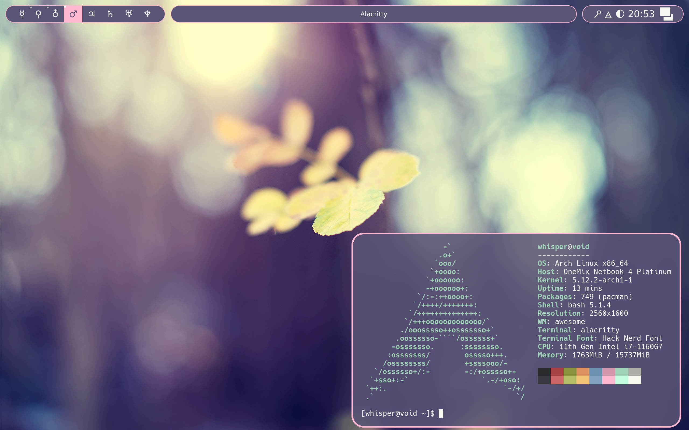

# dotfiles

**Distribution**: [Arch Linux](https://archlinux.org)

**Window Manager**: [AwesomeWM 4.3](https://github.com/awesomeWM/awesome) with [Lain](https://github.com/lcpz/lain)

**Compositor**: [ibhagwan's fork of picom](https://github.com/ibhagwan/picom)

**Terminal**: [Alacritty](https://github.com/alacritty/alacritty)

**Cursors**: [macOSBigSur](https://github.com/ful1e5/apple_cursor)